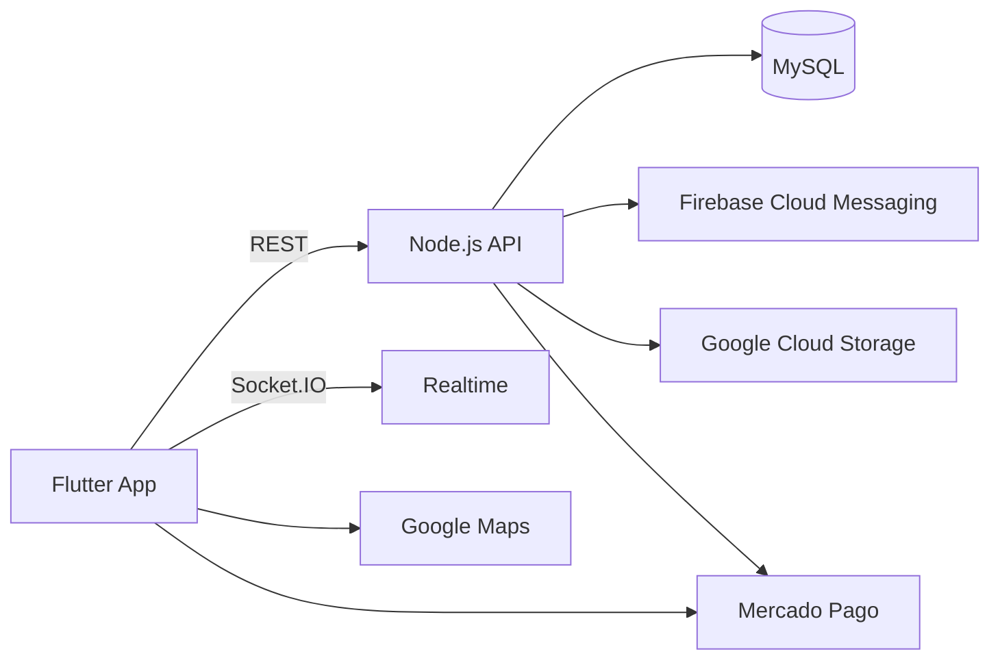

# AppDelivery

Monorepo de una plataforma de delivery con cliente movil en Flutter y backend en Node.js + MySQL.

Este README es la vista general del proyecto.
La documentacion tecnica detallada de cada modulo esta en:

- Backend: [BackendDeliveryMySQL-main/README.md](BackendDeliveryMySQL-main/README.md)
- Frontend: [flutter_delivery_mysql-master/README.md](flutter_delivery_mysql-master/README.md)

## 1. Vision general

AppDelivery implementa un flujo multirol:

- Cliente: selecciona productos, paga y monitorea pedido.
- Restaurante: gestiona catalogo y despacho.
- Repartidor: recibe asignaciones, comparte ubicacion y confirma entrega.

## 2. Arquitectura de alto nivel



## 3. Estructura del repositorio

```text
AppDelivery/
|- BackendDeliveryMySQL-main/
|  `- README.md
|- flutter_delivery_mysql-master/
|  `- README.md
`- README.md
```

## 4. Requisitos globales

- Node.js 18+
- npm
- MySQL 8+
- Flutter 3.x
- Java 17
- Android SDK
- Credenciales de Firebase, Mercado Pago, Google Maps y GCP

## 5. Quick start (equipo)

1. Clonar repositorio:

```bash
git clone https://github.com/JeanVillamar/AppDelivery.git
cd AppDelivery
```

2. Configurar y levantar backend:

```bash
cd BackendDeliveryMySQL-main
npm install
node server.js
```

3. Configurar y levantar frontend:

```bash
cd ../flutter_delivery_mysql-master
flutter pub get
flutter run
```

## 6. Flujo funcional base

```text
PAGADO -> DESPACHADO -> EN CAMINO -> ENTREGADO
```

## 7. Convenciones de equipo

- Mantener contratos API y eventos socket sincronizados entre backend y frontend.
- No subir secretos ni credenciales reales al repositorio.
- Documentar cualquier cambio tecnico en el README del modulo afectado.

## 8. Documentacion por modulo

- Backend API, base de datos, sockets, troubleshooting:
  - [BackendDeliveryMySQL-main/README.md](BackendDeliveryMySQL-main/README.md)
- Frontend Flutter, estructura, rutas y configuracion:
  - [flutter_delivery_mysql-master/README.md](flutter_delivery_mysql-master/README.md)

## 9. Licencia

Proyecto con fines academicos y demostrativos.